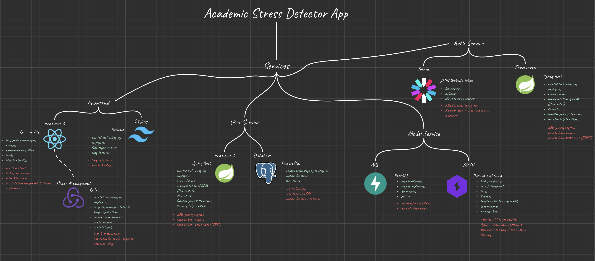

# 🔐 Academic Stress Detector - User Service

## 💡 Overview

User Service of this application was built using Spring Boot and Maven. PosgreSQL was choosen as the shared database across auth and user services. This micro-service purpose is to create, modify and delete user sessions. Appplication also allows user to change username or email and it communicates with model service to get predictions about sessions.



## 🗒️ Features
* JWT authorization method;
* PostgreSQL databse;
* CORS:
* Role authentication using PreAuthorize Decorators;
* Request filtering;

## ⚙️ Command Tools

To work with this project locally or in a containerized environment, use the following commands:
```bash
./mvnw spring-boot:run # to run project

./mvnw clean # clean logs


export {PROPERTY_NAME}={VALUE} # set env variable 
````

## 🧠 Tech Stack
<p align="center">
  <a href="https://skillicons.dev">
    
  </a>
</p>